---
<<<<<<< HEAD
title: "Seminar 2 - "
bibliography: ../tds.bib
toc: true
execute:
  cache: true
  message: false
  warning: false
  eval: false
editor:
  markdown:
    wrap: 72
format:
  html:
    code-overflow: wrap
    citations-hover: false
    footnotes-hover: false
    crossrefs-hover: false
---

# Seminar 2: Will Deakin

## Make Things as Simple as Possible...but no Simpler

The slides and high-resolution versions of some images from [the talk are available here](https://github.com/anisotropi4/shambles/tree/main/tds)

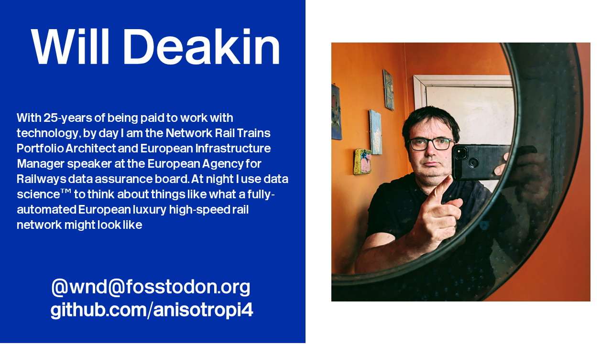{width=720}

## The Global Railway

The railway is international, noting the location of the United Kingdom

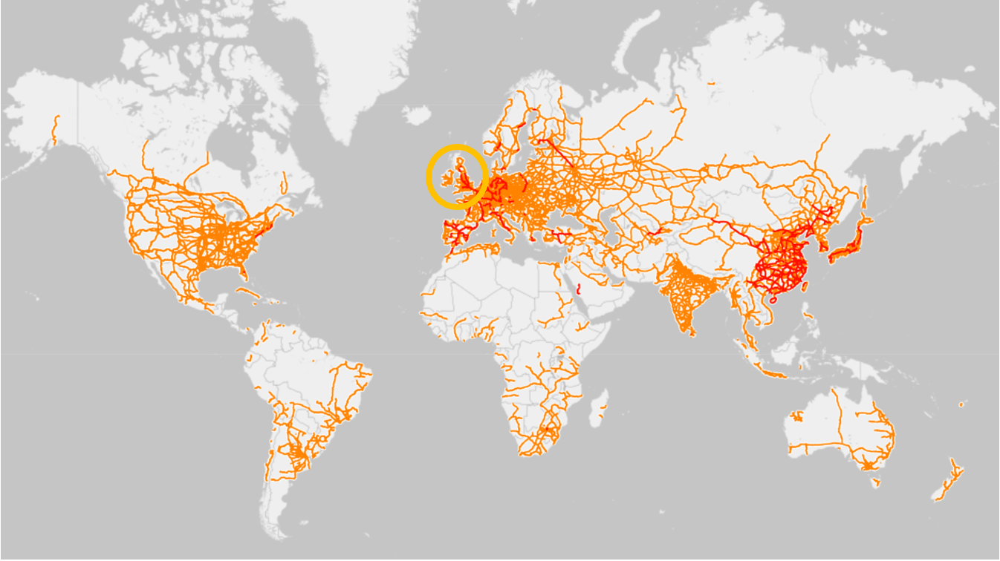{width=720}

## The British Railway

The operation of railway infrastructure in Britain is organised into thirteen routes and six regions.

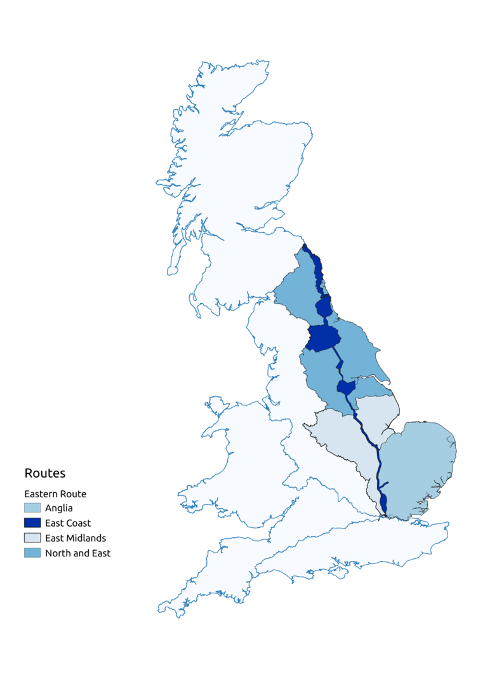{width=480}

This diagram show four routes that make up the Eastern region.

# Logical Models

To understand the a complex system like the railway it helps to decompose the system into a set of logical processes.


## Logical Network Model

The timetable production process can be modeled as a series of processes and interactions between railway operators and infrastructure manager.

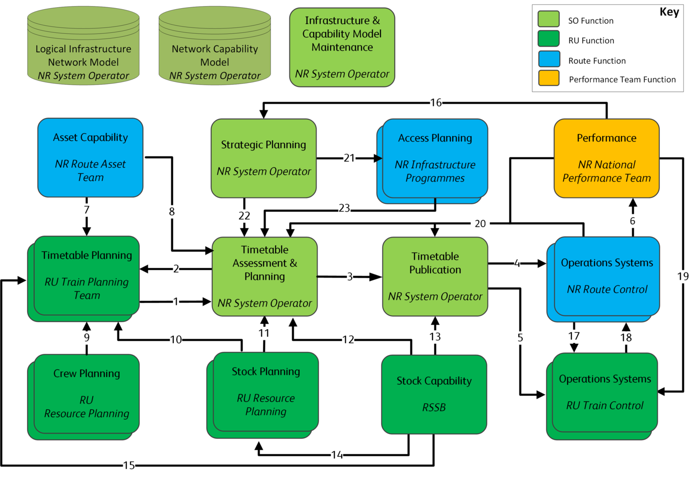{width=720}

## Logical Operations Model

The operation production process can be modeled as series of processes and data exchange.

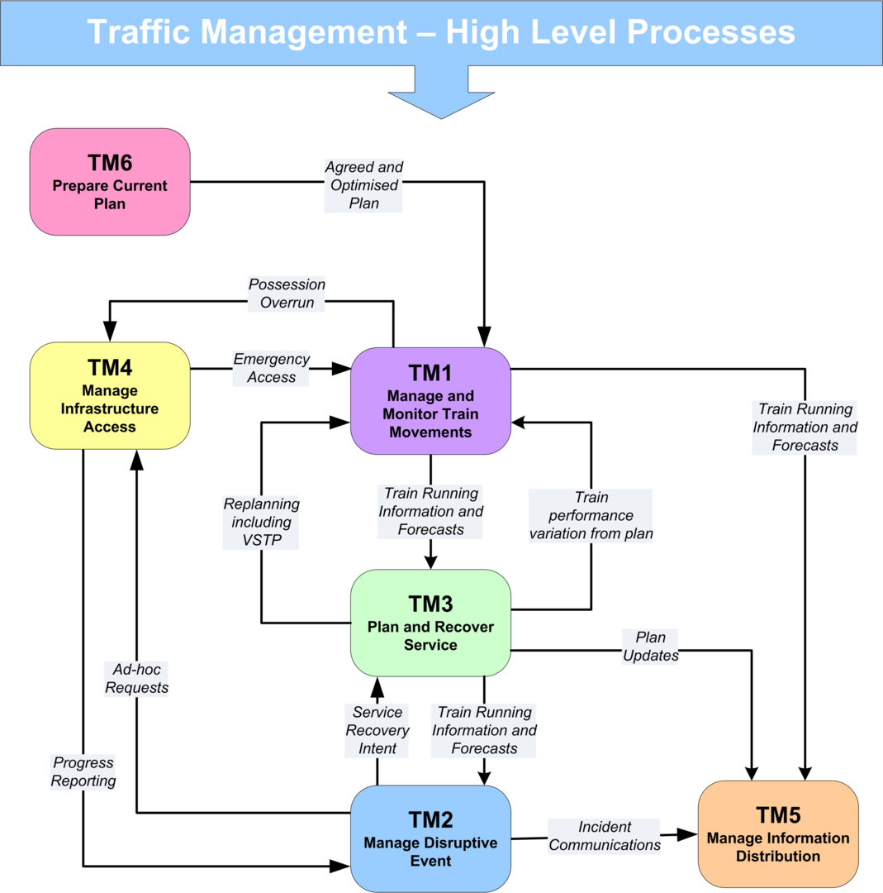{width=480}

# Emissions

Why does rail matter

{width=720}

Climate change and environmental degradation are an existential threat to UK, Europe and the world

- We need rail modal shift to rail freight transport to delivery
- no net emissions of greenhouse gases by 2050
- economic growth decoupled from resource use
- where no person and no place left behind

(From the European Rail Green Deal 2019)

## Green House Gases (CO~2~)

UK produced 455 million tonnes CO~2~ equivalent (mtCO2e) in 2019


Transport accounted for 122 mtCO2e (26.8%) of which


- HGV 19.5 mtCO2e (16.0%/4.2%)
- All rail 1.7 mtCO2e (1.4%/0.04%)
- A freight train removes up to 76 HGVs from our roads

## National Greenhouse Emissions 1990-2020

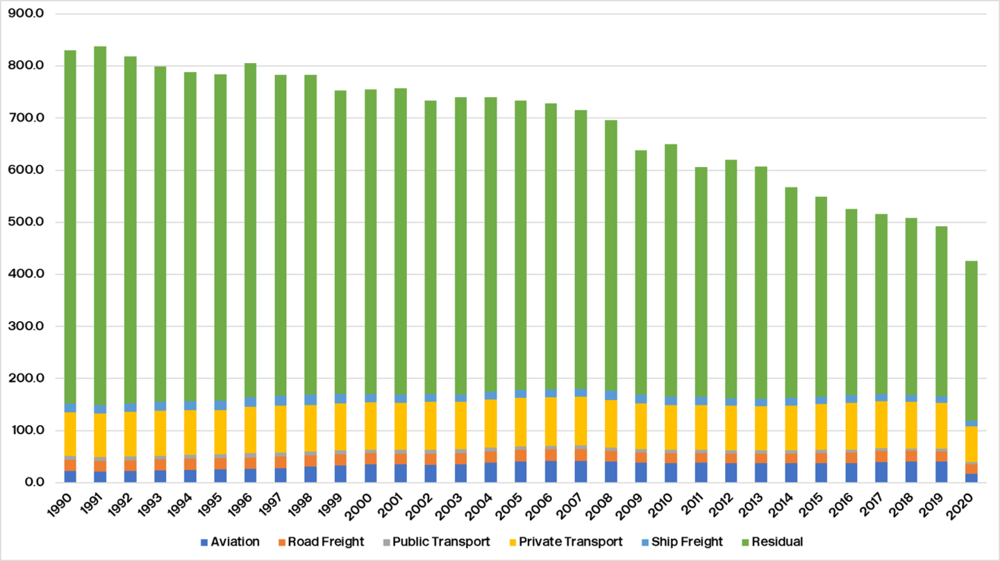{width=720}

## Transport Greenhouse Emissions 1990-2020
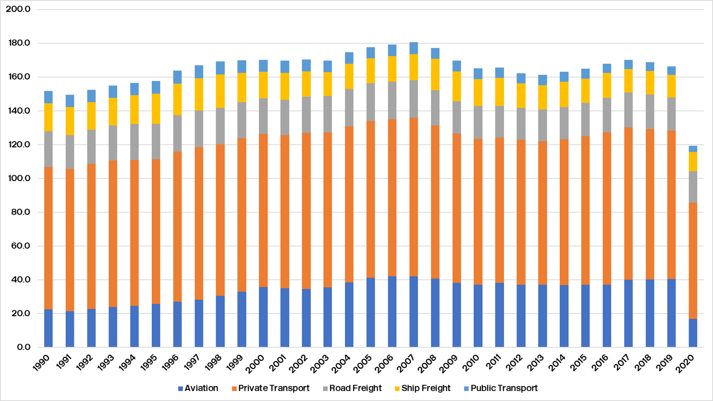{width=720}


(from DfT Transport Statistics (2021))

# Data Visualisation

Rail electrification

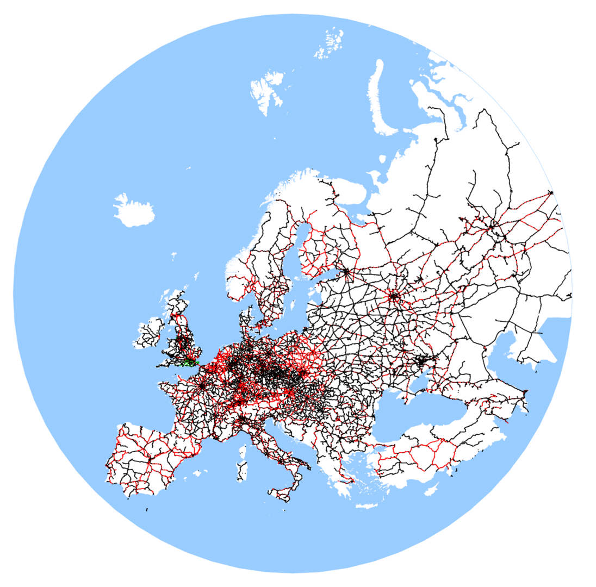{width=720}

Rail network in black, electrified rail in red.

## System Visualisation

An Open-TrainTimes (OTT) schematic view of Leeds Stations

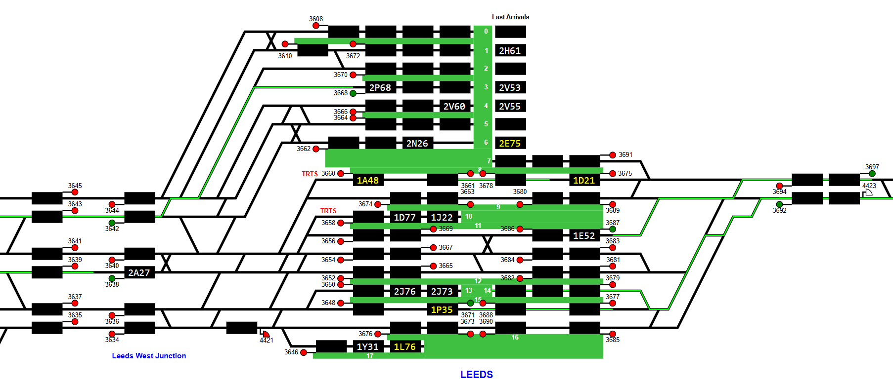{width=720}

- OpenTrainTimes: [here](https://www.opentraintimes.com/maps/signalling/spc5#T_LEEDS)
- National Rail Enquiries [here](https://ojp.nationalrail.co.uk/service/planjourney/search)
- Realtime Trains [here](https://www.realtimetrains.co.uk/search/detailed/gb-nr:LDS)


## Operation Railway
The view of live operational railway systems.

{width=720}


# A Very European Railway

A full automated luxury high-speed European rail network

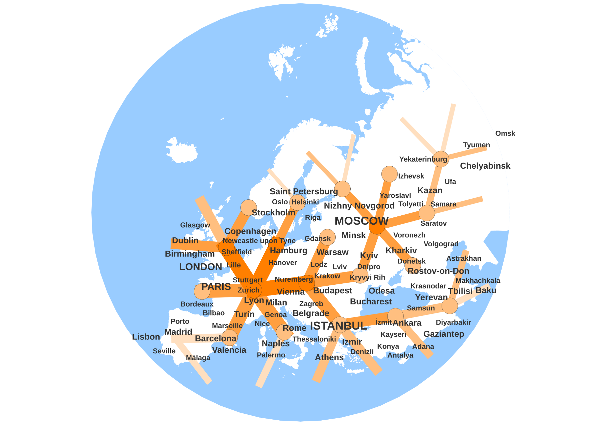{width=480}
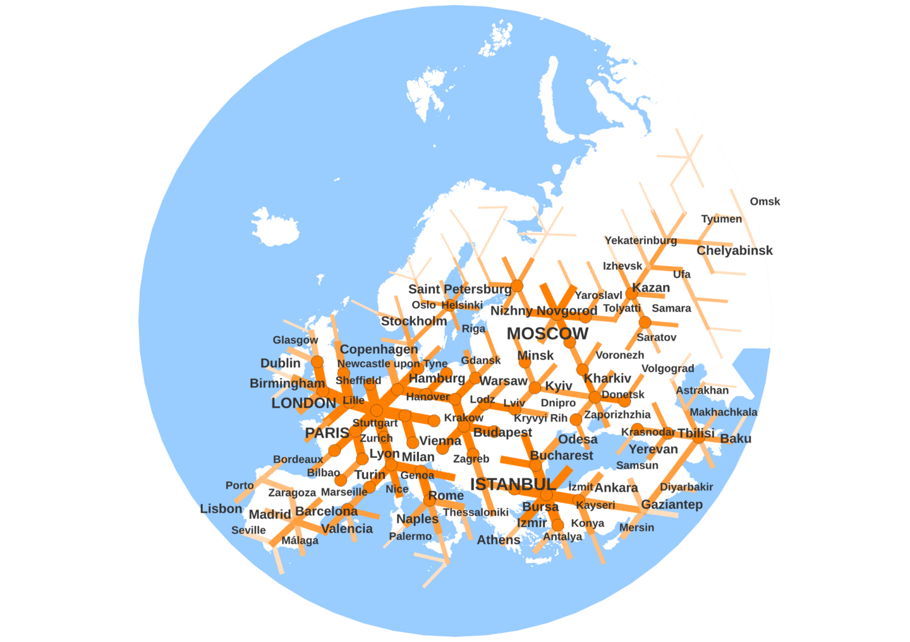{width=480}
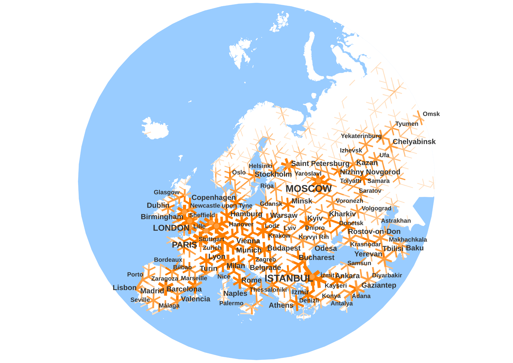{width=480}

Projecting population data onto labeled, scaled h3 hexagon to create a theoretical high-speed rail network.

# Insights from Open Data

Using Office of Road and Rail (ORR) Origin and Destination Matrix (ODM) data for rail journeys overlaid onto the railway centre-line track-model.

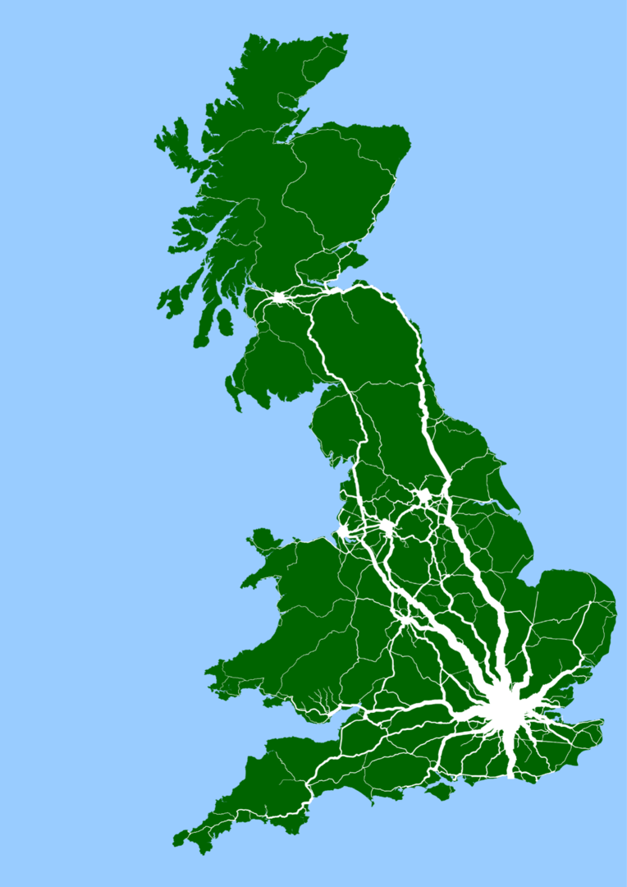{width=480}

## The Power of Social Media

The benefit of positive social media interaction.

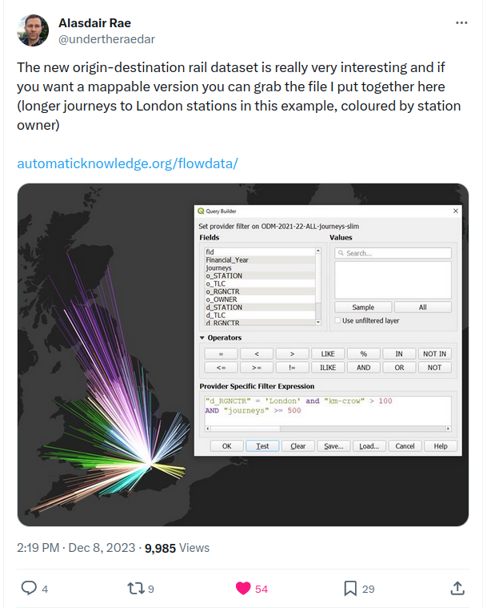

## The Power of Open Data

All data used is on the basis that it under open or permissive license.

1.  The base map of mainland Britain is derived from the [WorldPop](https://hub.worldpop.org/) base maps under [CC 4.0 by deed](https://creativecommons.org/licenses/by/4.0/) retrieved 2023-09-07.
2.  The centre-line track-model is hosted by [OpenRailData](https://github.com/openraildata/network-rail-gis) under the [Open Government License](https://www.nationalarchives.gov.uk/doc/open-government-licence/version/3/)(OGL) by Network Rail, retrieved 2023-07-11.
3.  The [Origin Destination Matrix](https://raildata.org.uk/partnerDetails/1034/details) data, for example ODM 2022-23, were published by the Office of Road and Rail on the Rail Development Group Rail Data Marketplace, under the [OGL](https://www.nationalarchives.gov.uk/doc/open-government-licence/version/3/). Retrieved 2024-02-18.
4.  The [Station Attributes for All-Mainline Stations](https://raildata.org.uk/partnerDetails/1034/details) published by the Office of Road and Rail under the [OGL](https://www.nationalarchives.gov.uk/doc/open-government-licence/version/3/). Retrieved 2024-02-18.
5.  The [Network Rail CORPUS dataset]() is an open data feed which is released under the [OGL](https://www.nationalarchives.gov.uk/doc/open-government-licence/version/3/). Retrieved 2023-11-29 as a local copy.
6.  The [National Public Transport Access Network]() (NaPTAN) under the [OGL](https://www.nationalarchives.gov.uk/doc/open-government-licence/version/3/) and is updated each time the scripts are run.
7.  While this implementation now uses NaPTAN and CORPUS to validate and identify six closed stations, the Isle of Wight ferry-link continues to use OpenStreetMap data, licensed under [CC-BY-SA 2.0](https://openstreetmap.org/copyright) through the [OverPassAPI Turbo](https://overpass-turbo.eu/) service, and is updated each time the scripts are run.


## 15 Seconds of Fame

The original 2018/19 visualisation recieved 500k X/Twitter views within a week, as well as an [OpenInnovations blog](https://open-innovations.org/blog/2024-01-08-passenger-journeys-pictures-at-a-rail-transport-exhibition) post and a Bloomberg article [Nine Maps Show How Britain Is on the Move](https://www.bloomberg.com/news/features/2024-02-08/british-rail-train-ticket-data-maps-show-how-a-nation-travels-before-hs2).

All code and data is published on GitHub under my [anisotropi4/kingfisher](https://github.com/anisotropi4/kingfisher) repository and updated with the ORR publication of the additional 2020-2024 financial year data.

## Simple Visualisations

The squares and coolest countries in Europe.

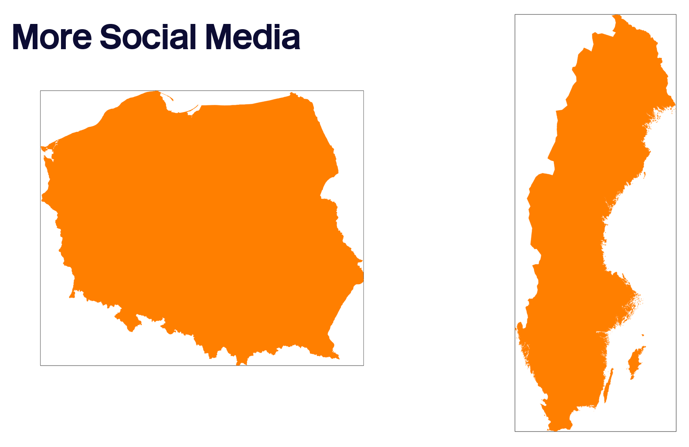{width=720}

# Network Simplification

Simplifing the full 2011 Output Area (OA) network to project .

## Shortest path census flow

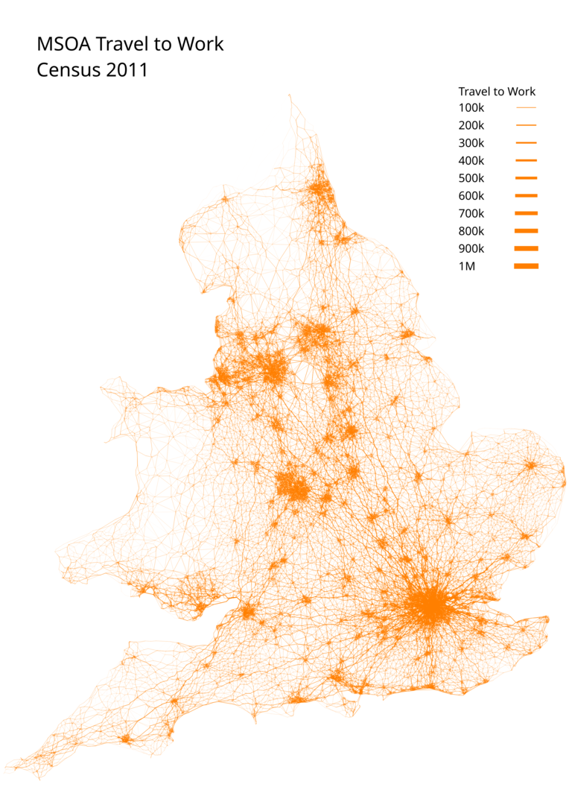{width=360}

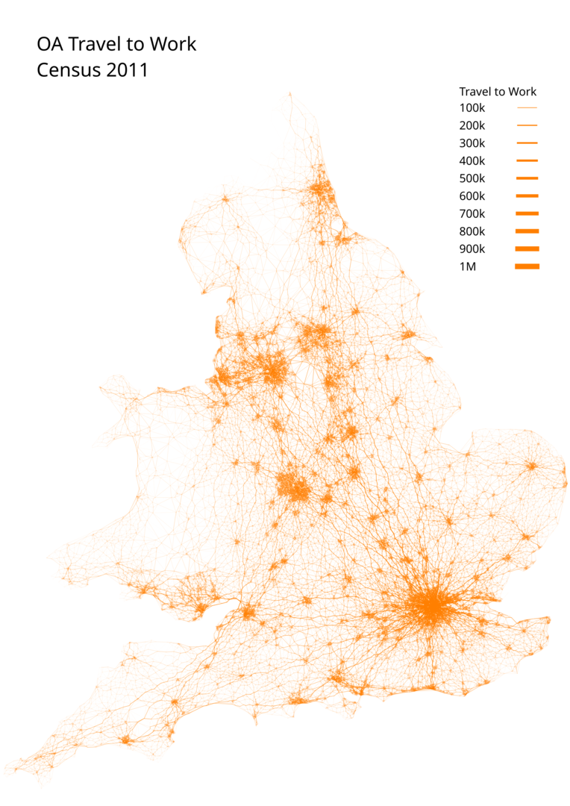{width=360}

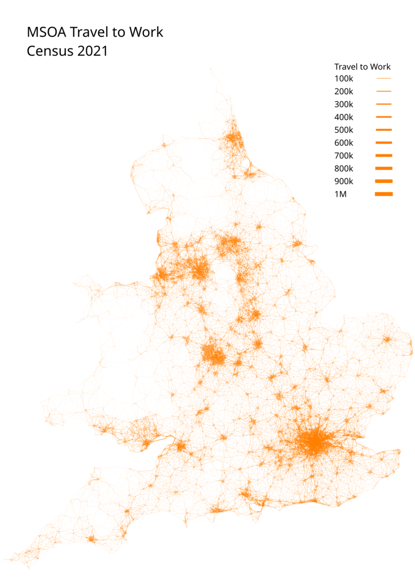{width=360}

## Output Area (OA) Census 2011 centroid

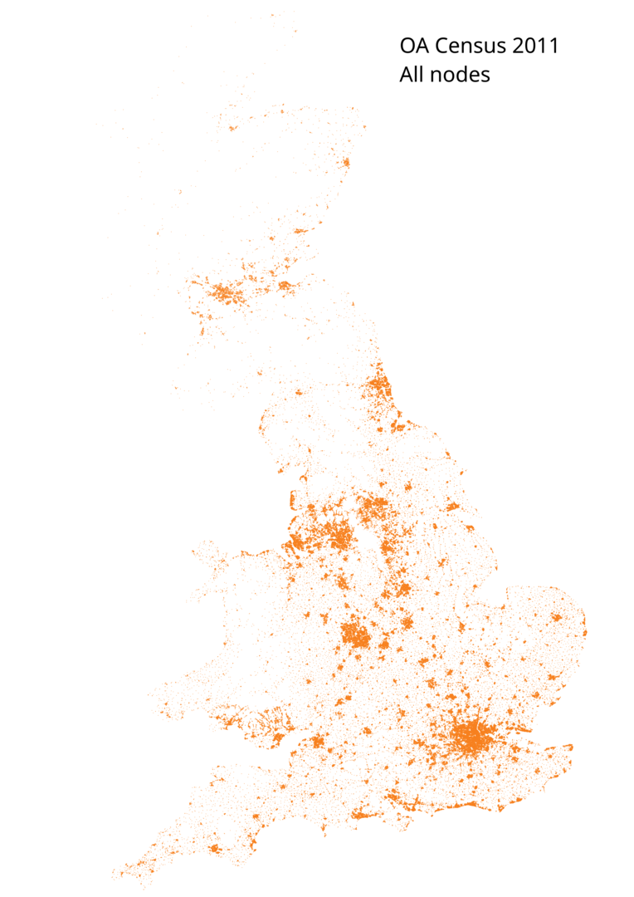{width=480}

## Full OA 2011 Delaunay mesh

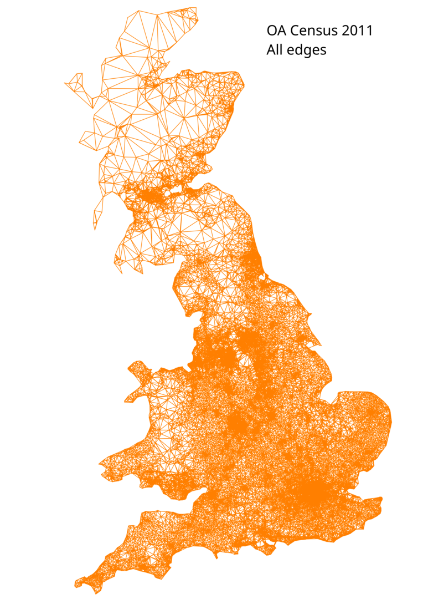{width=480}

## OA 2011 ODM mesh

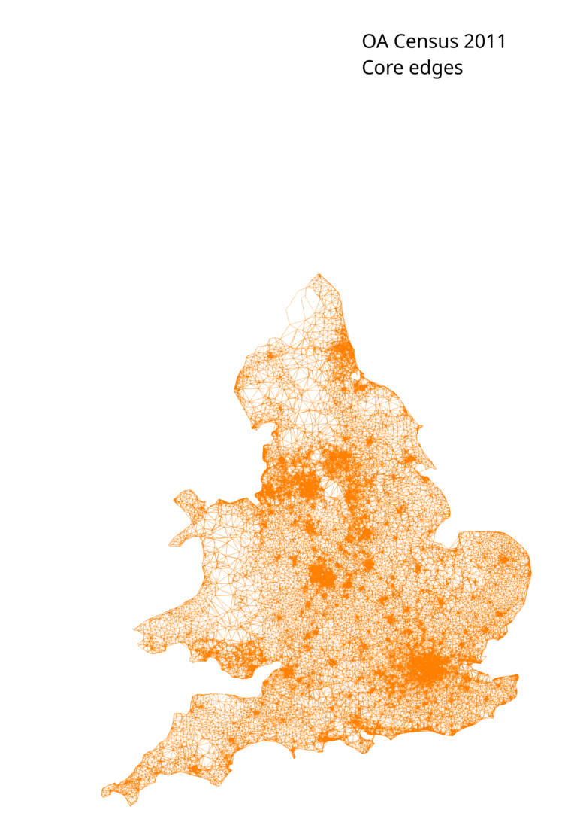{width=480}

## Network simplification and parenx

The [network merge paper is here](https://nptscot.github.io/networkmerge/paper.html).

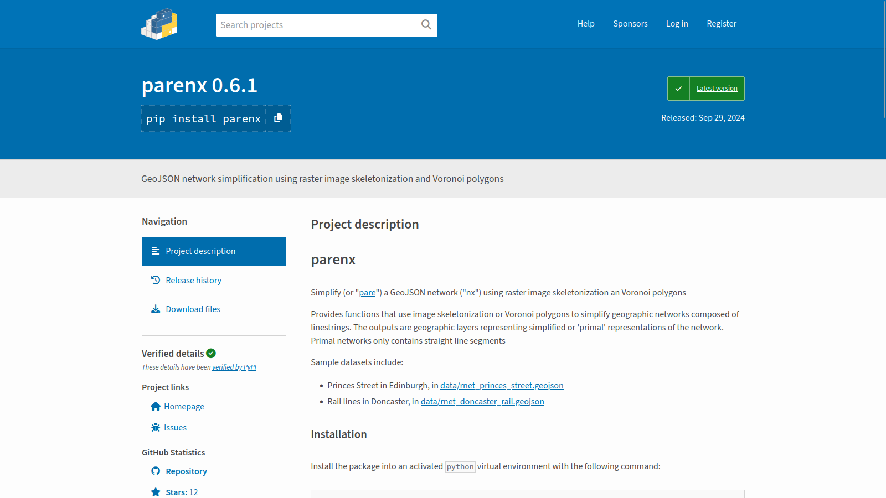{width=720}

The [parenx](https://pypi.org/project/parenx/) PyPi module.

### parenx cookbook

The [parenx cookbook](https://nptscot.github.io/networkmerge/cookbook.html) shows examples of how to use the parenx library.

# Parting Words

## Make it look good.

{width=480}

Art E-coli statue.

## The Railway

Beeching 1963 and today.

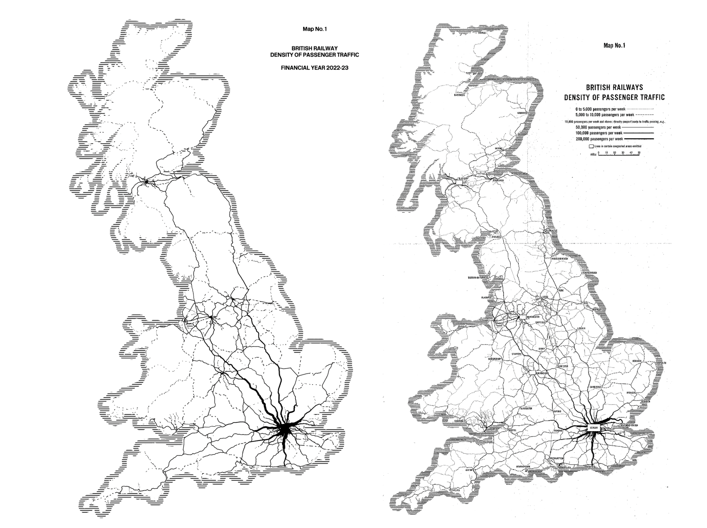{width=720}

# References

::: {}
(@) Wikipedia, International Klein Blue (#002FA7), [here](https://en.wikipedia.org/wiki/International_Klein_Blue)
(@) Rail Alphabet, description and download, [here](https://www.strathpefferjunction.com/british-railway-typefaces-fonts/)
(@) SPSmiler, “London Underground Tube”, [here](https://commons.wikimedia.org/wiki/File:Why_London_Underground_is_nicknamed_The_Tube.jpg)
(@) Homer, Iliad, Perseus Digital Library [here](http://www.perseus.tufts.edu/hopper/text?doc=Perseus:text:1999.01.0133), accessed 4 May 2022
(@) Transport Statistics Department for Transport, [here](https://www.gov.uk/government/statistics/transport-statistics-great-britain-2021/transport-statistics-great-britain-2021)
(@) Department for Business, Energy & Industry Strategy, [here](https://www.gov.uk/government/publications/greenhouse-gas-reporting-conversion-factors-2021)
(@) Open Rail Data wiki, [here](https://wiki.openraildata.com/index.php/Main_Page)
(@) Rail Development Group “Concept of Operations – Stock and Crew System”  (RDG-CONOPS/NTI/002 Issue 1.1) January 2021 [here](https://www.raildeliverygroup.com/media-centre-docman/acop/284-rdgconceptofoperations-stockandcrewv1-0-reformat/file.html)
(@) National Electronic Sectional Appendix (NESA) [here](https://www.networkrail.co.uk/industry-and-commercial/information-for-operators/national-electronic-sectional-appendix/)
(@) NESA table extract [here](https://github.com/anisotropi4/nesa)
(@) Department for Transport Energy and environment: data tables (ENV0201) [here](https://www.gov.uk/government/statistical-data-sets/energy-and-environment-data-tables-env)
(@) WorldPop Project [here](https://www.worldpop.org/), data licensed under [creative commons 4.0](https://creativecommons.org/licenses/by/4.0/)
(@) EC Global Human Settlement layer [here](), data licensed under [creative commons 4.0](https://creativecommons.org/licenses/by/4.0/)
(@) OpenStreetMap [here](), data licensed under [Open Database License (ODbL) v1.0](https://opendatacommons.org/licenses/odbl/1-0/)
(@) Overpass Turbo [here](https://overpass-turbo.eu/)
(@) python language [here](), licensed under PSF for python 3.11 [here](https://docs.python.org/3/license.html)
(@) Pandas [here](https://pandas.pydata.org/), licensed under BSD 3-clause license
(@) GeoPandas [here](https://geopandas.org/), licensed under BSD 3-clause license
(@) Department for Transport “Great British Railways: Williams-Shapps plan for rail”, [here](https://www.gov.uk/government/publications/great-british-railways-williams-shapps-plan-for-rail)
(@) UK Electrification map, [here](https://electricrailmap.gitlab.io/)
(@) Railway Industry Association “Why Rail Electrification”, 2021, [here](https://www.riagb.org.uk/RIA/Newsroom/Publications%20Folder/Why_Rail_Electrification_Report.aspx)
(@) European Agency for Railways “Fostering Rail Through Green Deal – part 2 Freight”, 2021, [here](https://www.era.europa.eu/content/era-report-fostering-railway-sector-through-european-green-deal-part-2-freight_en)
(@) RailNet Europe, “Timetabling and Capacity Redesign (TTR)”, 2022, [here](https://rne.eu/sales-timetabling/ttr)
(@) Network Rail, “Rail freight forecasts Scenarios for 2033-34 and 2043-44”, 2016, [here](https://www.networkrail.co.uk/wp-content/uploads/2020/08/Rail-freight-forecasts-Scenarios-for-2033-34-and-2043-44.pdf)
(@) Shapely [here](https://shapely.readthedocs.io/en/stable/), licensed under BSD 3-clause license
(@) Rasterio [here](https://rasterio.readthedocs.io/en/latest/index.html), under the Rasterio license [here](https://rasterio.readthedocs.io/en/stable/intro.html)
(@) Tobler [here](https://pysal.org/tobler), under BSD license
(@) QGIS [here](), under the Attribution-ShareAlike 3.0 license
(@) OSMnx: Boeing, G. 2017. [OSMnx](https://geoffboeing.com/publications/osmnx-complex-street-networks/): New Methods for Acquiring, Constructing, Analyzing, and Visualizing Complex Street Networks. Computers, Environment and Urban Systems 65, 126-139.
(@) Uber H3 [here](https://github.com/uber/h3-py), licensed under the Apache license 2.0
:::
=======
title: "Session 2: Getting transport datasets with R"
toc: true
execute: 
  cache: true
  #eval: true
  warning: false
  message: false
bibliography: ../tds.bib
#jupyter: python3
engine: knitr
---

# Introduction

In this session, we will learn how to get transport datasets using R.
The contents of the session are as follows:

- We'll start with a short lecture on data sources and ways of classifying transport datasets (see the [slides](https://itsleeds.github.io/tds/s2/slides.html))
- Reviewing the homework from the previous session
- Session activities: importing and exploring a range of transport datasets in your own time
- Bonus: exploring the Cadence platform
- Homework for the next session

## Review Homework

You should now be familiar with the basics of R, Quarto and the structure of transport datasets, having completed the [homework](https://itsleeds.github.io/tds/s1/#homework) from the previous session.

We will do a demo of trying to reproduce the demo from last week and discuss any issues you had running the code in Chapter 13 of [Geocomputation with R](https://r.geocompx.org).

## Prerequisites

Note: you may need to install the `pct` package as follows:

```
remotes::install_github("ITSLeeds/pct")
```

We will also load the following packages:

```{r}
#| results: hide
library(tidyverse)
library(sf)
library(tmap)
```

Note that this session uses imports and uses geographic data with the `sf` package.
Read more about the package in chapters 2 onwards in [Geocomputation with R](https://r.geocompx.org) and in the [sf package documentation](https://r-spatial.github.io/sf/).

# Getting OpenStreetMap data

Work through the reproducible code in the "Introducing osmextract" vignette hosted at [https://docs.ropensci.org/osmextract/articles/osmextract.html](https://docs.ropensci.org/osmextract/articles/osmextract.html).

## Bonus exercises

- Reproduce the examples
- Get all supermarkets in OSM for West Yorkshire
- Identify all cycleways in West Yorkshire and, using the stats19 data you have already downloaded, identify all crashes that happened near them.

```{r}
#| eval: false
#| echo: false
library(tidyverse)
library(osmextract)
region_name = "west yorkshire"
supermarket_points = oe_get(
  place = region_name,
  extra_tags = "shop",
  query = "SELECT * FROM points WHERE shop='supermarket'"
)
supermarket_polygons = oe_get(
  place = region_name,
  extra_tags = "shop",
  query = "SELECT * FROM multipolygons WHERE shop='supermarket'"
)
nrow(supermarket_points) # 81
nrow(supermarket_polygons) # 261
# Deduplicate points
supermarket_points_in_polygons = supermarket_points |>
  sf::st_filter(supermarket_polygons)
nrow(supermarket_points_in_polygons)  # none
supermarket_polygon_centroids = supermarket_polygons |>
  sf::st_centroid()
waldo::compare(names(supermarket_points), names(supermarket_polygons))
supermarket_points_combined = rbind(
  supermarket_points |>
    select(osm_id, name),
  supermarket_polygon_centroids |>
    select(osm_id, name)  
)
supermarket_frequency = supermarket_points_combined |>
  count(name, sort = TRUE)
length(supermarket_frequency$name) # 77
supermarket_frequency$name[1:20]
supermarket_points_cleaned = supermarket_points_combined |>
  mutate(
    name = case_when(
      name == "" ~ "Unnamed",
      str_detect(name, "Tesco") ~ "Tesco",
      str_detect(name, "Sainsbury") ~ "Sainsbury's",
      str_detect(name, "Asda") ~ "Asda",
      str_detect(name, "Morrisons") ~ "Morrisons",
      str_detect(name, "Aldi|ALDI") ~ "ALDI",
      str_detect(name, "Lidl") ~ "Lidl",
      str_detect(name, "Co-op|Coop") ~ "Co-op",
      str_detect(name, "M&S|Marks & Spencer") ~ "M&S",
      TRUE ~ name
    )
  )
supermarket_frequency_cleaned = supermarket_points_cleaned |>
  count(name, sort = TRUE)
length(supermarket_frequency_cleaned$name) # 66
supermarket_top_6 = supermarket_frequency_cleaned |>
  slice_max(n, n = 6)
supermarket_points_cleaned = supermarket_points_cleaned |>
  mutate(name_simplified = case_when(
    name %in% supermarket_top_6$name ~ name,
    TRUE ~ "Other"
  )) 
# Save the result:
sf::st_write(supermarket_points_cleaned, "supermarkets_points_cleaned.geojson", delete_dsn = TRUE)
system("gh release upload 2025 supermarkets_points_cleaned.geojson --clobber")
```

Import and visualise a dataset with supermarket names and locations with the following code (see the [source code of the session](https://github.com/itsleeds/tds/discussions/166) to see how the supermarket data was obtained with `osmextract`):

```{r}
supermarkets = sf::read_sf("https://github.com/ITSLeeds/tds/releases/download/2025/supermarkets_points_cleaned.geojson")
library(tmap)
tmap_mode("view")
tm_shape(supermarkets) +
  tm_dots("name_simplified")
```

# Getting road traffic casualty data

Work through the reproducible code in the ["Getting started with stats19" vignette hosted at docs.ropensci.org/stats19](https://docs.ropensci.org/stats19/articles/stats19.html).

# Boundary datasets

Boundary datasets are useful for mapping and spatial analysis, providing the geographical context for other datasets.
You can download geographic datasets directly from the [ONS Geoportal](https://geoportal.statistics.gov.uk/).

You can also search for boundary datasets using the `esri2sf` package, which provides a function `esrisearch` to search for datasets on the ESRI ArcGIS platform.
To illustrate this programatic way of getting boundary data, we will search for the "Local Authority Districts December 2024 Boundaries UK" dataset and download it using the `arcgis` package.

```{r}
#| eval: false
pak::pkg_install("elipousson/esri2sf")
remotes::install_github("r-arcgis/arcgis", dependencies = TRUE)
res = esri2sf::esrisearch("Local Authority Districts (May 2023) Boundaries UK")
res = res |>
  dplyr::filter(type == "Feature Service") |>
  # # 2023 versions:
  # dplyr::filter(str_detect(title, "2023")) |>
  # BUC: 
  dplyr::filter(str_detect(title, "BUC")) 
res$title
u_from_res = paste0(res$url[1], "/0")
library(arcgis)
res_sf = arc_read(u_from_res)
plot(res_sf$geometry)
```

# Census data

## The ONS "create a custom dataset" tool

The Office for National Statistics (ONS) provides a tool to create custom datasets. The tool is flexible and provides datasets in a variety of formats, including CSV. Give the tool a try at [www.ons.gov.uk/datasets/create](https://www.ons.gov.uk/datasets/create).
To test the tool, try to get data on travel to work patterns for all usual residents in England and Wales at the local authority level (note: you may need to change the file name to match the one you downloaded).

```{r}
#| eval: false
#| echo: false
# Upload result to GitHub release
system("gh release list")
system("gh release upload 2025 custom-filtered-2025-02-04T00_06_30Z.csv")

# And res_sf:
sf::write_sf(res_sf, "lad_boundaries_2023.geojson")
system("gh release upload 2025 lad_boundaries_2023.geojson")
```

```{r}
#| echo: false
# Download the datasets:
base_url = "https://github.com/ITSLeeds/tds/releases/download/2025/"
if (!file.exists("custom-filtered-2025-02-04T00_06_30Z.csv")) {
  download.file(paste0(base_url, "custom-filtered-2025-02-04T00_06_30Z.csv"), "custom-filtered-2025-02-04T00_06_30Z.csv")
}
if (!file.exists("lad_boundaries_2023.geojson")) {
  download.file(paste0(base_url, "lad_boundaries_2023.geojson"), "lad_boundaries_2023.geojson")
}
```

```{r}
res_sf = sf::st_read("lad_boundaries_2023.geojson")
travel_to_work_lad = readr::read_csv("custom-filtered-2025-02-04T00_06_30Z.csv")
# names(travel_to_work_lad)
# [1] "Lower tier local authorities Code"                      
# [2] "Lower tier local authorities"                           
# [3] "Distance travelled to work (8 categories) Code"         
# [4] "Distance travelled to work (8 categories)"              
# [5] "Method used to travel to workplace (12 categories) Code"
# [6] "Method used to travel to workplace (12 categories)"     
# [7] "Observation" 
travel_to_work_updated = travel_to_work_lad |>
  select(
    LAD23CD = `2023 Lower tier local authorities Code`,
    Mode = `Method used to travel to workplace (12 categories)`,
    Distance = `Distance travelled to work (8 categories)`,
    Observation = Observation
  )
# Pivot wider:
ttw_wide = travel_to_work_updated |>
  pivot_wider(names_from = c(Distance, Mode), values_from = Observation)
summary(res_sf[["LAD23CD"]] %in% travel_to_work_lad[[1]]) 
# Other way around:
summary(travel_to_work_lad[[1]] %in% res_sf[["LAD23CD"]])
# names(ttw_wide)
```

# The cadence platform

Sign up to Cadence website at [cadence360.cityscience.com/](https://cadence360.cityscience.com/) by clicking 'Sign In' in the top right. New users can then either create an account or sign in to an existing account.

# Joining datasets

Two key ways to join datasets are by spatial location and by a common key. We will demonstrate the latter using the `dplyr` package.

```{r}
lad_joined = left_join(
  res_sf,
  ttw_wide
)
```

Let's visualise the results with a choropleth map made using `ggplot2`.

```{r}
ggplot(lad_joined) +
  geom_sf(aes(fill = `Less than 5km_Driving a car or van`), colour = NA) +
  scale_fill_viridis_c() +
  theme_minimal()
```

See [r.geocompx.org/spatial-operations](https://r.geocompx.org/spatial-operations#spatial-joining) for spatial joins.

# Homework

1. In preparation for the next session, take a read of and try to reproduce the code in the [vignette "An introduction to origin-destination data"](https://cran.r-project.org/web/packages/od/vignettes/od.html) for the `od` package.
<!-- https://itsleeds.github.io/pct/articles/pct.html -->
    - Import some OD data using the `pct` package, as documented at [itsleeds.github.io/pct](https://itsleeds.github.io/pct/articles/pct.html).

2. Download and visualise 3 transport-related datasets of your choice and save the results in a reproducible .qmd file.
    - Bonus: generate a .pdf document showing the results.

3. Take a quick read of, and try to reproduce some of the code in, at least three of the chapters in R4DS:
    - [Chapter 1: Data visualisation](https://r4ds.hadley.nz/data-visualize)
    - [Chapter 3: Data transformation](https://r4ds.hadley.nz/data-transform.html)
    - [Chapter 28: Quarto](https://r4ds.hadley.nz/quarto.html)
    - One of you choice, e.g. 
        - [Chapter 5: Data tidying](https://r4ds.hadley.nz/data-tidy.html)
        - [Chapter 19: Joins](https://r4ds.hadley.nz/joins.html)

4. Try to reproduce and modify the code I wrote during the live demo to get OSM data for a city of your choice.
    - See the [source code here: https://github.com/itsleeds/tds/blob/main/s2/demo.qmd](https://github.com/itsleeds/tds/blob/main/s2/demo.qmd)
    - See the results here: [https://itsleeds.github.io/tds/s2/demo.html](https://itsleeds.github.io/tds/s2/demo.html)

5. Check-out the code I used to generate the interactive map of source code in this Discussion on GitHub: https://github.com/itsleeds/tds/discussions/166
    - Bonus: comment on the discussion with your thoughts on the code and how it could be improved.
    - Bonus 2: try opening a new Discussion comment in the tds repo at [github.com/itsleeds/tds/discussions](https://github.com/itsleeds/tds/discussions) and share your thoughts on the session.
>>>>>>> 21c60dadd8afab33df597e739a9edfba5d586d33
